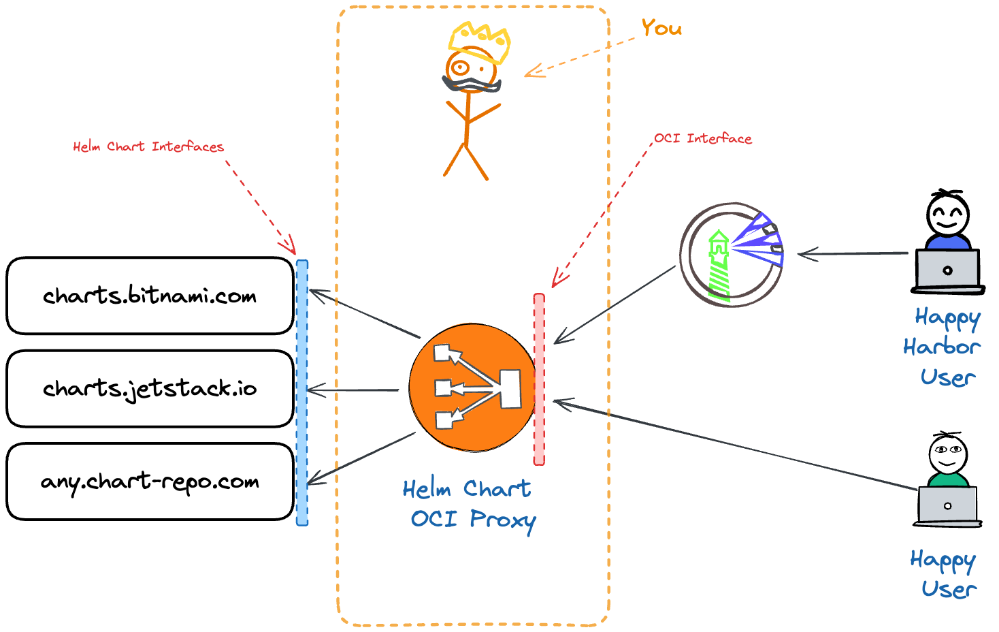
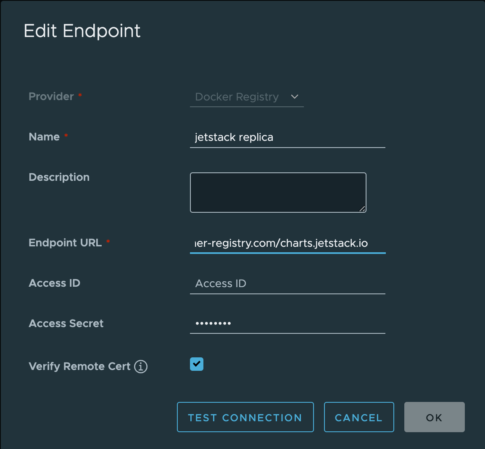
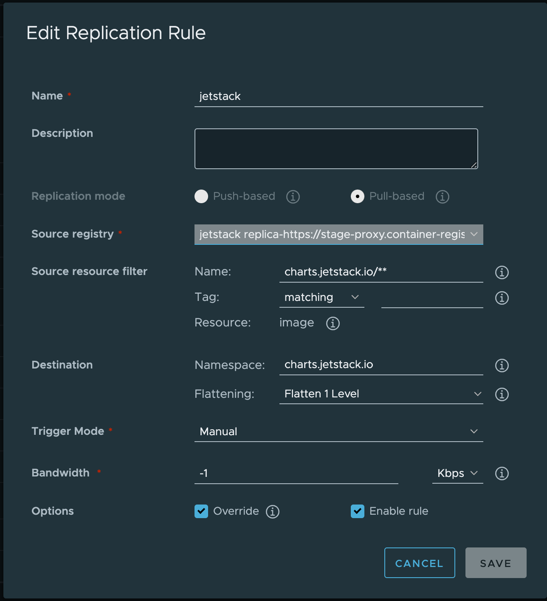

# Helm Chart OCI Proxy

Transparently proxy and transform [Chart Repository styled](https://helm.sh/docs/topics/chart_repository/) Helm Charts as OCI artifacts. Now you can address any public Chart Repository styled Helm Chart as an OCI image.

<p align="center"></p>


## Usage

```bash  
helm pull oci://chartproxy.container-registry.com/charts.jetstack.io/cert-manager --version 1.11.2
```  
  
#### Use with Harbor

You can use the Helm Chart OCI Proxy with Harbor Container Registry when you add each endpoint that you want to proxy explicitly.

Example Endpoint URL: `https://chartproxy.container-registry.com/**charts.jetstack.io**?

<p align="center"></p>

Then you can a replication rule.

<p align="center"></p>

  
## Installation  
  
You can install and operate the service yourself, we currently provide a handy helm chart, so you can get started.

```bash

```
  

  
## Develop  
  
```shell  
./do.sh build
```  

### Run Locally  
```shell  
./do.sh run
```  
  
### Test  
  
Test without specifying a version will pull the latest version
  
```shell  
helm pull --repository-cache=/tmp2 oci://registry:9000/charts.jetstack.io/cert-manager-istio-csr  
helm pull oci://stage-proxy.container-registry.com/charts.jetstack.io/cert-manager-istio-csr  
helm pull oci://stage-proxy.container-registry.com/charts.bitnami.com/bitnami/airflow  
helm pull oci://stage-proxy.container-registry.com/charts.bitnami.com/bitnami/airflow --version 14.0.11  
```  

With specific version

```shell  
helm pull --repository-cache=/tmp2 oci://registry:9000/charts.jetstack.io/cert-manager-istio-csr --version 0.2.1
```  
  
### Environment Variables  
  
* `PORT` - specifies port, default `9000`  
* `DEBUG` - enabled debug if it's `TRUE`  
* `CACHE_TTL` - for how many seconds we have to store manifest and related blobs, default value is 60  
* `USE_TLS` - enabled HTTP over TLS  
  
  
### TODO  
  
* CI/CD Pipeline with GitHub Action  
* Add tests  
* Add helm index cache layer
