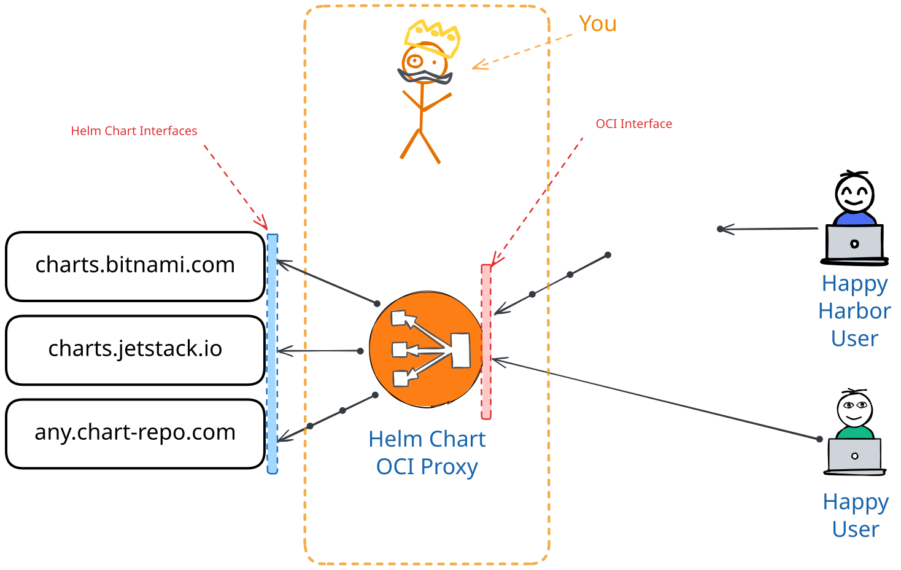
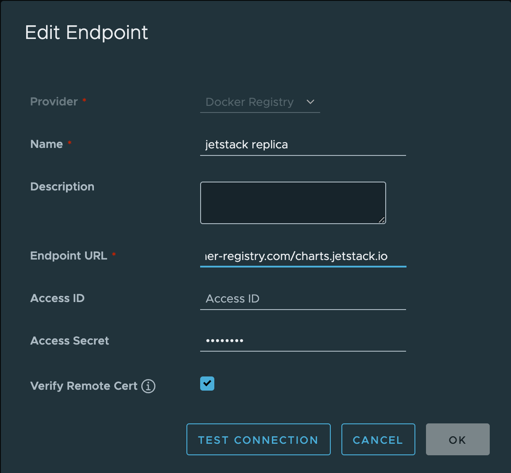
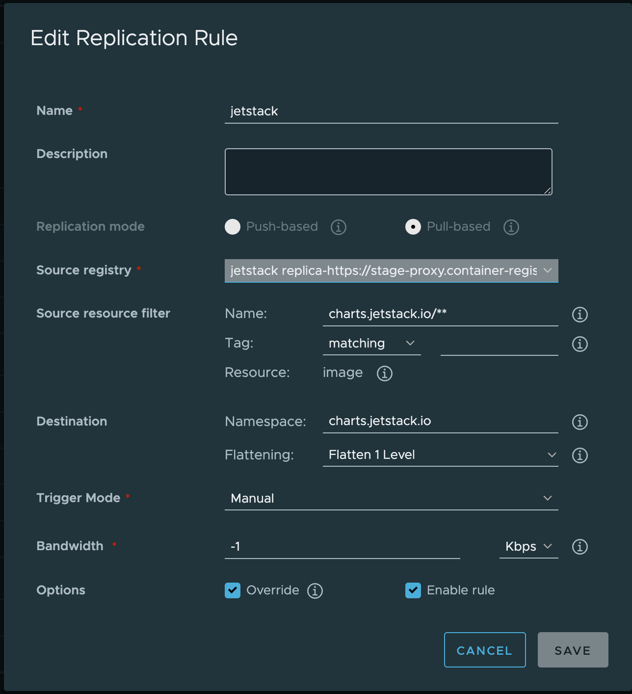

[](https://artifacthub.io/packages/helm/helm-charts-oci-proxy/helm-charts-oci-proxy)

# Helm Chart OCI Proxy

Transparently proxy and transform [Chart Repository styled](https://helm.sh/docs/topics/chart_repository/) Helm Charts as OCI artifacts. Now you can address any public Chart Repository styled Helm Chart as an OCI styled artifact.

> [!NOTE]
> Helm Chart OCI Proxy is now built into [8gears Container Registry (8gcr)](https://github.com/container-registry/harbor-next). Give it a try


<p align="center"></p>

## What is it good for?

This proxy was primary designed after Harbor 2.8 removed support for [Chart Repository](https://helm.sh/docs/topics/chart_repository/) in favor of OCI. The proxy can be used without Harbor implementing other use cases.

* Store all 3rd party public Helm Charts in your OCI compliant registry. While you can switch the storage and distribution of your Helm Charts easily, it is close to impossible to do so for all sorts of 3rd party Helm Charts.
* Simplify your workflow and tooling by only using the OCI Helm Chart and not a mix of both
* Use it in combination with [Skopeo](https://github.com/containers/skopeo) to copy Helm Charts into your OCI registry of choice.

## Usage

Use our free hosted version via [chartproxy.container-registry.com](https://chartproxy.container-registry.com) or [host it yourself](#user-content-installation).

### Example

Here is an example of how you can use the service.
The following helm command will fetch `cert-manager` as an OCI Helm Chart, located on charts.jetstack.io.

```bash  
helm pull oci://chartproxy.container-registry.com/charts.jetstack.io/cert-manager --version 1.11.2
```  

If you do not specify a version, the system will retrieve the latest version.

```bash  
helm pull oci://chartproxy.container-registry.com/charts.bitnami.com/bitnami/airflow #will use latest
```  


#### Use with Harbor

You can use the Helm Chart OCI Proxy with the Harbor Container Registry.
Each chart repository needs to be added as its own registry endpoint.

Set the provider to _Docker Registry_ and the Endpoint URL to the proxy host followed by the
**complete path of the chart repository**, that is the URL under which its `index.yaml` lives, without `index.yaml`.
For `https://charts.jetstack.io/index.yaml` that is `https://chartproxy.container-registry.com/charts.jetstack.io`.
For `https://open-telemetry.github.io/opentelemetry-helm-charts/index.yaml` it is
`https://chartproxy.container-registry.com/open-telemetry.github.io/opentelemetry-helm-charts`, not just the host.

The path matters for wildcard filters. Harbor expands them through the registry catalog, and the proxy can only
enumerate a repository that is named in the endpoint URL. With a bare host, the catalog lists just the charts
already requested through that proxy instance, so a wildcard replicates nothing or a stray chart, while filters
that name each chart still work.

<p align="center"></p>

After adding the endpoint, create the replication rule with the proxy endpoint as the source registry.
The source resource filter uses the full repository name as the catalog lists it, `<repo host>/<repo path>/<chart>`:

| Goal | Name filter | Tag filter | Needs the path in the endpoint URL |
|------|-------------|------------|------------------------------------|
| Every chart in the repository | `open-telemetry.github.io/opentelemetry-helm-charts/**` | `**` | yes |
| A set of charts | `open-telemetry.github.io/opentelemetry-helm-charts/opentelemetry-{operator,collector}` | `**` | no |
| One chart, every version | `open-telemetry.github.io/opentelemetry-helm-charts/opentelemetry-operator` | `**` | no |
| One chart, one version | `open-telemetry.github.io/opentelemetry-helm-charts/opentelemetry-operator` | `0.63.0` | no |

Set the destination flattening to _Flatten All Levels_ if you want `<project>/<chart>` in Harbor instead of the
full path.

<p align="center"></p>


## Installation

[](https://artifacthub.io/packages/search?repo=helm-charts-oci-proxy)

Install and operate the service yourself, we currently provide a handy Helm Chart, so you can get started quickly.

Our Helm Charts are only available as OCI artifacts. Unlike with traditional Charts where you
need to add a Repo first. With OCI, you can install the Chart with one command.

```bash
helm install chartproxy --create-namespace --namespace chartproxy oci://8gears.container-registry.com/library/helm-charts-oci-proxy
```

Use `helm pull` to only pull the chart to your local disc, without installing.

```bash
helm pull oci://8gears.container-registry.com/library/helm-charts-oci-proxy
```

### Installation outside Kubernetes

The container image runs with any container runtime. It listens on port `9000` and needs no configuration.
`latest` is fine for a first try, for anything that stays running pin a release tag `vX.Y.Z` (see [tags](#image-and-chart-tags)):

```bash
docker run --rm -p 9000:9000 8gears.container-registry.com/library/helm-charts-oci-proxy:latest
```

Helm expects OCI registries to speak HTTPS. Against a plain HTTP instance, pass `--plain-http`:

```bash
helm pull --plain-http oci://localhost:9000/charts.jetstack.io/cert-manager --version 1.11.2
```

To serve TLS directly, mount a certificate and key and set `USE_TLS=true`. `CERT_FILE` and `KEY_FILE`
name the files inside the container. Without them the proxy looks for `certs/registry.pem` and
`certs/registry-key.pem` relative to its working directory, which is `/` in the image, so the defaults resolve to
`/certs/registry.pem` and `/certs/registry-key.pem`.

```bash
docker run --rm -p 9000:9000 \
  -e USE_TLS=true -e CERT_FILE=/certs/tls.crt -e KEY_FILE=/certs/tls.key \
  -v "$PWD/certs:/certs:ro" \
  8gears.container-registry.com/library/helm-charts-oci-proxy:latest
```

Harbor, Helm and other OCI clients then talk to `https://<host>:9000` without extra flags, provided they trust
the certificate. Alternatively run the proxy behind a reverse proxy or ingress that terminates TLS, as the Helm
chart does.

If the certificate or key cannot be read, the proxy currently keeps running with a listener that never completes a
TLS handshake and only reports the error when it shuts down. Check the container log for
`listening HTTP over TLS` followed by a successful `curl -k https://localhost:9000/api/version` after starting it.

#### Image and chart tags

The image and the Helm chart share the repository `8gears.container-registry.com/library/helm-charts-oci-proxy`
and are told apart by their tags:

| Tag | Artifact |
|-----|----------|
| `vX.Y.Z` | Application image of [release](https://github.com/container-registry/helm-charts-oci-proxy/releases) `vX.Y.Z` |
| `latest` | Image of the latest application release |
| `main`, `main-<7-char sha>` | Unreleased build of `main`. Only commits that touch the application get one, docs and chart-only commits are skipped, and a commit superseded while queued may be skipped too. List the tags first (`oras repo tags 8gears.container-registry.com/library/helm-charts-oci-proxy`) before pulling a specific SHA |
| `X.Y.Z` | Helm chart `X.Y.Z` (git tag `chart-vX.Y.Z`), whose `appVersion` pins the matching image tag |

Pulling a chart tag with `docker pull` fails with `unsupported media type application/vnd.cncf.helm.config.v1+json`.
Use `helm pull oci://.../helm-charts-oci-proxy --version X.Y.Z` for charts and `docker pull ...:vX.Y.Z` for images.
Every release image is signed with cosign and carries an SBOM attestation. The verification commands are in the release notes.


## Development

Build the binary (requires [Task](https://taskfile.dev))

```shell  
task app:build
```  

### Run Locally
```shell  
task app:run
```  

### Run Tests

```shell  
task app:test
task app:vet
```  

For a manual smoke check start the binary without TLS and pull a chart through it; without `--version` the
latest version is served:

```shell  
task app:build
PORT=9000 .bin/proxy registry serve
helm pull --plain-http oci://localhost:9000/charts.jetstack.io/cert-manager-istio-csr
helm pull --plain-http oci://localhost:9000/charts.jetstack.io/cert-manager-istio-csr --version 0.2.1
```  

### Environment Variables

There are not many options in configure the application except the following.

* `PORT` - specifies port, default `9000`
* `DEBUG` - enables debug logging for any truthy value (`true`, `1`), default `false`
* `MANIFEST_CACHE_TTL` - for how long we have stores manifest and its related blobs, the default value is `60` seconds.
* `INDEX_CACHE_TTL` - for how long we store chart index file content, the default value is `14400` seconds (4h)
* `INDEX_ERROR_CACHE_TTL` - for how long we do not try to obtain index files again if it's failed for some reason. The default value is `30` seconds.
* `USE_TLS` - enabled HTTP over TLS
* `CERT_FILE` - TLS certificate path when `USE_TLS` is set, default `certs/registry.pem`
* `KEY_FILE` - TLS private key path when `USE_TLS` is set, default `certs/registry-key.pem`
* `REWRITE_DEPENDENCIES` - rewrites chart dependency repository URLs to point through the proxy. When enabled, dependencies like `https://charts.bitnami.com/bitnami` become `oci://<proxy-host>/charts.bitnami.com/bitnami`. Default is `false`.
* `PROXY_HOST` - override the proxy host used in rewritten dependency URLs. If not set, uses the Host header from incoming requests.
* `ALLOW_PRIVATE_NETWORKS` - allow upstream downloads from private, loopback, and link-local addresses. Off by default as an SSRF guard; enable only when proxying chart repositories on an internal network. Default is `false`.

### Dependency URL Rewriting

When a Helm chart has dependencies, those repository URLs are hardcoded in `Chart.yaml`. By default, even if you pull the parent chart through this proxy, Helm will fetch dependencies from their original public URLs.

With `REWRITE_DEPENDENCIES=true`, the proxy rewrites dependency URLs so all charts are also fetched through the proxy:

```yaml
# Original Chart.yaml dependency
dependencies:
  - name: redis
    repository: https://charts.bitnami.com/bitnami

# After rewriting (when PROXY_HOST=chartproxy.container-registry.com)
dependencies:
  - name: redis
    repository: oci://chartproxy.container-registry.com/charts.bitnami.com/bitnami
```

The `rewrite_dependencies` query parameter overrides the setting per request. Helm does not accept query
strings in OCI references, so this only works for clients that speak the registry API directly:

```bash
# Enable rewriting for this manifest request
curl -H 'Accept: application/vnd.oci.image.manifest.v1+json' \
  "https://chartproxy.example.com/v2/charts.bitnami.com/bitnami/redis/manifests/1.0.0?rewrite_dependencies=true"

# Disable rewriting for this manifest request
curl -H 'Accept: application/vnd.oci.image.manifest.v1+json' \
  "https://chartproxy.example.com/v2/charts.jetstack.io/cert-manager/manifests/1.11.2?rewrite_dependencies=false"
```

The following URL types are NOT rewritten:
- `file://` - local file dependencies
- `@alias` or `alias:` - Helm repository aliases
- Empty URLs

> [!WARNING]
> Enabling `REWRITE_DEPENDENCIES` modifies the `Chart.yaml` inside the chart tarball, which will break Helm chart signature verification. If you rely on provenance files (`.prov`) or `helm verify`, do not use this feature.
